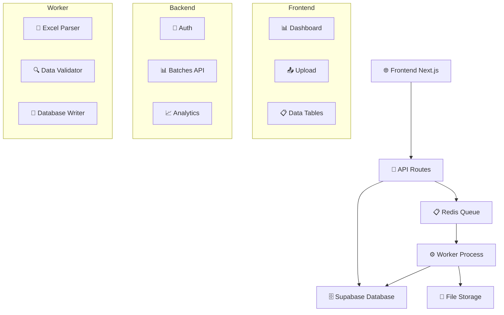

# 🚀 FluxMat

<div align="center">


**Plateforme intelligente de gestion des flux de déchets**

[](https://nextjs.org/)
[](https://www.typescriptlang.org/)
[](https://supabase.com/)
[](https://redis.io/)
[](https://docs.bullmq.io/)

[](https://opensource.org/licenses/MIT)
[](http://makeapullrequest.com)

</div>

---

## 📋 Table des matières

- [🎯 À propos](#-à-propos)
- [✨ Fonctionnalités](#-fonctionnalités)
- [🏗️ Architecture](#️-architecture)
- [🚀 Installation](#-installation)
- [⚙️ Configuration](#️-configuration)
- [📖 Utilisation](#-utilisation)
- [🔧 API](#-api)
- [📊 Monitoring](#-monitoring)
- [🤝 Contribution](#-contribution)
- [📄 Licence](#-licence)

---

## 🎯 À propos

**FluxMat** est une plateforme moderne et intelligente dédiée à la gestion des flux de déchets. Conçue pour les organisations soucieuses de leur impact environnemental, elle permet de traiter, analyser et suivre efficacement les données de déchets via des fichiers Excel.

### 🌟 Pourquoi FluxMat ?

- **📊 Traitement intelligent** : Analyse automatique des fichiers Excel avec validation des données
- **🔄 Déduplication** : Élimination automatique des doublons grâce à des clés de hachage
- **⚡ Performance** : Architecture worker asynchrone pour traiter de gros volumes
- **🎨 Interface moderne** : Dashboard intuitif avec visualisations en temps réel
- **🔒 Sécurité** : Authentification robuste et gestion des permissions

---

## ✨ Fonctionnalités

### 🎨 Interface Utilisateur
- **Dashboard interactif** avec visualisations en temps réel
- **Upload de fichiers** avec drag & drop
- **Tableaux de données** avec filtrage et tri avancés
- **Design responsive** optimisé pour tous les écrans

### ⚙️ Traitement des Données
- **Import Excel** : Support des fichiers .xlsx avec parsing intelligent
- **Validation automatique** : Vérification des formats de dates et tonnages
- **Filtrage intelligent** : Exclusion automatique des données personnelles
- **Déduplication** : Système de clés MD5 pour éviter les doublons

### 🔄 Architecture Worker
- **Queue Redis** : Gestion asynchrone des tâches de traitement
- **Scalabilité** : Traitement parallèle avec contrôle de concurrence
- **Monitoring** : Suivi des jobs en temps réel
- **Récupération d'erreurs** : Gestion robuste des échecs

---

## 🏗️ Architecture



### 🏛️ Stack Technologique

| Composant | Technologie | Version |
|-----------|-------------|---------|
| **Frontend** | Next.js + React | 15.5.6 |
| **Backend** | Next.js API Routes | 15.5.6 |
| **Database** | Supabase (PostgreSQL) | 2.75.1 |
| **Queue** | Redis + BullMQ | 5.61.0 |
| **Worker** | Node.js + TypeScript | 5.9.3 |
| **Styling** | Tailwind CSS | 4.0 |
| **Charts** | AG Grid | 34.2.0 |

---

## 🚀 Installation

### 📋 Prérequis

- **Node.js** >= 18.0.0
- **pnpm** >= 8.0.0
- **Redis** (local ou cloud)
- **Compte Supabase**

### 🔧 Installation des dépendances

```bash
# Cloner le repository
git clone https://github.com/MaxCtn/Fluxmat.git
cd Fluxmat

# Installer les dépendances du frontend
cd fluxmat
pnpm install

# Installer les dépendances du worker
cd ../fluxmat-worker
pnpm install
```

---

## ⚙️ Configuration

### 🔐 Variables d'environnement

Créez un fichier `.env.local` dans le dossier `fluxmat/` :

```env
# Supabase
NEXT_PUBLIC_SUPABASE_URL=your_supabase_url
NEXT_PUBLIC_SUPABASE_ANON_KEY=your_supabase_anon_key
SUPABASE_SERVICE_ROLE=your_service_role_key

# Redis
REDIS_URL=redis://localhost:6379
REDIS_TOKEN=your_redis_password

# Application
NEXT_PUBLIC_APP_URL=http://localhost:3000
```

### 🗄️ Configuration Supabase

1. Créez un nouveau projet sur [Supabase](https://supabase.com)
2. Configurez les tables suivantes :

```sql
-- Table des organisations
CREATE TABLE organizations (
  id UUID PRIMARY KEY DEFAULT gen_random_uuid(),
  name TEXT NOT NULL,
  created_at TIMESTAMP WITH TIME ZONE DEFAULT NOW()
);

-- Table des batches
CREATE TABLE batches (
  id UUID PRIMARY KEY DEFAULT gen_random_uuid(),
  org_id UUID REFERENCES organizations(id),
  status TEXT DEFAULT 'pending',
  raw_file_url TEXT,
  rows_in INTEGER DEFAULT 0,
  rows_ok INTEGER DEFAULT 0,
  rows_warn INTEGER DEFAULT 0,
  rows_err INTEGER DEFAULT 0,
  error_message TEXT,
  started_at TIMESTAMP WITH TIME ZONE,
  finished_at TIMESTAMP WITH TIME ZONE,
  created_at TIMESTAMP WITH TIME ZONE DEFAULT NOW()
);

-- Table des enregistrements
CREATE TABLE records (
  id UUID PRIMARY KEY DEFAULT gen_random_uuid(),
  org_id UUID REFERENCES organizations(id),
  batch_id UUID REFERENCES batches(id),
  date_operation DATE,
  nature_dechet TEXT,
  origine TEXT,
  destination TEXT,
  tonnage DECIMAL(10,3),
  raw JSONB,
  dedup_key TEXT,
  created_at TIMESTAMP WITH TIME ZONE DEFAULT NOW(),
  UNIQUE(org_id, dedup_key)
);
```

---

## 📖 Utilisation

### 🚀 Démarrage du développement

```bash
# Terminal 1 - Frontend
cd fluxmat
pnpm dev

# Terminal 2 - Worker
cd fluxmat-worker
pnpm start
```

### 📤 Upload de fichiers

1. Accédez à l'interface d'upload
2. Glissez-déposez votre fichier Excel
3. Le système traite automatiquement les données
4. Consultez les résultats dans le dashboard

### 📊 Format Excel attendu

Votre fichier Excel doit contenir les colonnes suivantes :

| Colonne | Description | Format |
|---------|-------------|--------|
| `Date` | Date de l'opération | DD/MM/YYYY ou YYYY-MM-DD |
| `Libellé Ressource` | Nature du déchet | Texte |
| `Libellé Entité` | Origine | Texte |
| `Libellé Chantier` | Destination | Texte |
| `Quantité` | Tonnage | Nombre décimal |
| `Origine` | Source (filtré si "pointage personnel") | Texte |
| `Chapitre` | Catégorie (filtré si contient "personnel") | Texte |

---

## 🔧 API

### 📊 Endpoints disponibles

#### `GET /api/batches`
Récupère la liste des batches

#### `POST /api/batches`
Crée un nouveau batch

#### `GET /api/batches/[id]`
Récupère les détails d'un batch

#### `GET /api/batches/[id]/summary`
Récupère le résumé d'un batch

#### `GET /api/health`
Vérifie l'état de santé de l'application

#### `GET /api/diag/redis`
Diagnostic de la connexion Redis

---

## 📊 Monitoring

### 🔍 Logs du Worker

Le worker affiche des logs détaillés :

```bash
[redis] connected
FluxMat worker démarré ✅
[job failed] job-id reason
```

### 📈 Métriques disponibles

- **Taux de succès** des traitements
- **Temps de traitement** moyen
- **Volume de données** traitées
- **Erreurs** et avertissements

---

## 🤝 Contribution

Nous accueillons les contributions ! Voici comment participer :

### 🍴 Fork et Clone

```bash
git clone https://github.com/MaxCtn/Fluxmat.git
cd Fluxmat
```

### 🌿 Créer une branche

```bash
git checkout -b feature/nouvelle-fonctionnalite
```

### 💾 Commit et Push

```bash
git add .
git commit -m "✨ Ajout d'une nouvelle fonctionnalité"
git push origin feature/nouvelle-fonctionnalite
```

### 🔄 Pull Request

1. Ouvrez une Pull Request sur GitHub
2. Décrivez vos modifications
3. Attendez la review

---

## 📄 Licence

Ce projet est sous licence MIT. Voir le fichier [LICENSE](LICENSE) pour plus de détails.

---

<div align="center">

**Fait avec ❤️ pour un monde plus vert**

[🌐 Site Web](https://fluxmat.com) • [📧 Contact](mailto:contact@fluxmat.com) • [🐛 Issues](https://github.com/MaxCtn/Fluxmat/issues)

</div>
