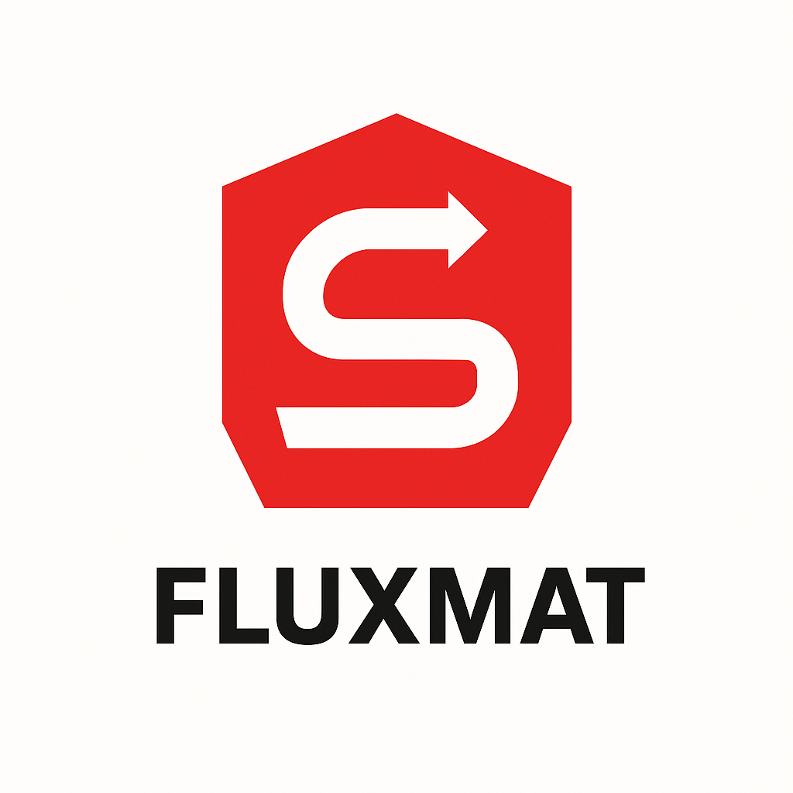
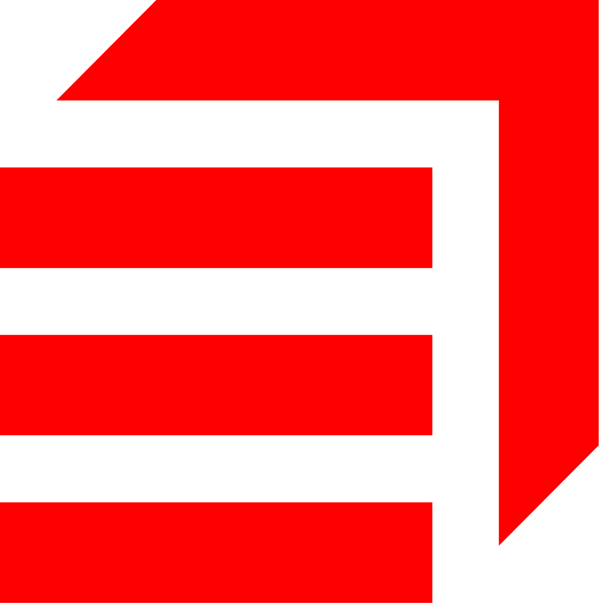

<div align="center">

# 📊 Fluxmat



**Application de gestion des flux matières et déchets pour Eiffage**

[](https://fluxmat.vercel.app)

</div>

---

## 🎯 Présentation

**Fluxmat** est une application web qui permet de gérer et suivre les flux de matières et déchets issus des chantiers Eiffage. Elle facilite l'import de données depuis PRC/PIDOT, la validation des codes déchets, et l'export vers les registres réglementaires.

## ✨ Fonctionnalités principales

- 📤 **Import de fichiers Excel** : Importez directement vos fichiers exportés depuis PRC/PIDOT
- 🔍 **Filtrage automatique** : Le système filtre automatiquement les lignes pertinentes selon les critères métier
- ✅ **Validation des codes déchets** : Vérifiez et complétez les codes déchets manquants
- 📊 **Tableau de bord** : Visualisez vos données par établissement, chantier et exutoire
- 📥 **Export** : Exportez vos données validées au format CSV

## 🔄 Comment ça fonctionne ?

### 1. Import d'un fichier

Lorsque vous importez un fichier Excel exporté depuis PRC/PIDOT :

1. Le fichier est analysé ligne par ligne
2. Chaque ligne est vérifiée automatiquement pour déterminer si elle correspond aux critères de suivi des déchets
3. Les lignes validées sont séparées en deux catégories :
   - **Lignes avec code déchet** : Prêtes à être exportées ✅
   - **Lignes sans code déchet** : Nécessitent une vérification ⚠️

### 2. Le système de tri automatique (pour les non-développeurs)

Le tri automatique fonctionne comme un **filtre intelligent** qui vérifie chaque ligne de votre fichier selon plusieurs critères :

#### ✅ **Critère 1 : L'origine de la dépense**
- Le système exclut automatiquement les lignes où l'origine est "Pointage personnel"
- ✅ **Résultat** : Seules les dépenses externes sont conservées

#### ✅ **Critère 2 : Le type de dépense (Chapitre Comptable)**
Le système ne garde que les dépenses qui font partie de certaines catégories :
- ✅ Matériaux & Consommables
- ✅ Matériel
- ✅ Sous-traitance & Prestataires
- ✅ Sous-traitance Produits Non Soumis à FGX

❌ **Tout le reste est automatiquement exclu**

#### ✅ **Critère 3 : Les sous-catégories exclues**
Certaines sous-catégories sont automatiquement ignorées :
- ❌ Aciers
- ❌ Consommables
- ❌ Frais annexes matériel

#### ✅ **Critère 4 : Le type de prestation (Rubrique Comptable)**
Le système ne conserve que les lignes qui correspondent à des prestations spécifiques liées aux déchets :
- ✅ Agrégats, Sable
- ✅ Enrobés à froid
- ✅ Location camions, matériel de transport
- ✅ Matériaux divers, Matériaux recyclés
- ✅ Mise en décharge, Traitement déchets inertes
- ✅ Et d'autres prestations similaires...

❌ **Les autres types de prestations sont exclues automatiquement**

#### 🎯 **Résultat final du tri**

À la fin de ce processus de tri, vous obtenez uniquement :
- ✅ Les lignes qui correspondent aux critères de suivi des déchets
- ✅ Les lignes qui sont des matériaux (terre, béton, enrobé, gravats, etc.)
- ✅ Les lignes prêtes pour le registre des flux de déchets

**En résumé** : Le système agit comme un **tamis intelligent** qui ne garde que les informations pertinentes pour le suivi des déchets, sans que vous ayez besoin de faire quoi que ce soit.

### 3. Validation et contrôle

Pour les lignes sans code déchet :
- Le système propose des suggestions basées sur le type de matériau
- Vous pouvez corriger et valider manuellement
- Une fois validées, les lignes passent dans la catégorie "avec code déchet"

### 4. Export

Les données validées peuvent être exportées au format CSV pour intégration dans vos registres réglementaires.

## 🚀 Installation

### Prérequis

- Node.js 18+ 
- pnpm (ou npm)
- Un compte Supabase

### Étapes d'installation

1. **Cloner le dépôt**
```bash
git clone https://github.com/MaxCtn/Fluxmat.git
cd Fluxmat
```

2. **Installer les dépendances**
```bash
pnpm install
```

3. **Configurer les variables d'environnement**
Créer un fichier `.env.local` :
```env
NEXT_PUBLIC_SUPABASE_URL=votre_url_supabase
SUPABASE_SERVICE_ROLE_KEY=votre_clé_service_role
```

4. **Configurer la base de données**
Exécuter les migrations SQL dans Supabase (voir `migrations/README.md`)

5. **Lancer l'application**
```bash
pnpm dev
```

L'application sera accessible sur `http://localhost:3000`

## 📁 Structure du projet

```
Fluxmat/
├── app/                    # Pages et routes Next.js
│   ├── api/               # Routes API
│   ├── import/            # Page d'import
│   ├── controle/          # Page de contrôle/validation
│   └── dashboard/         # Tableau de bord
├── components/            # Composants React réutilisables
├── lib/                   # Bibliothèques et utilitaires
│   ├── transform.ts       # Logique de transformation et filtrage
│   └── supabaseServer.ts # Client Supabase
├── migrations/            # Scripts SQL de migration
└── public/                # Assets statiques (logos, images)
```

## 🛠️ Technologies utilisées

- **Next.js 15** : Framework React
- **TypeScript** : Typage statique
- **Supabase** : Base de données et backend
- **Tailwind CSS** : Styling
- **XLSX** : Lecture de fichiers Excel

## 📝 Guide de connexion Supabase

Voir le fichier [`GUIDE_CONNECTION_SUPABASE.md`](GUIDE_CONNECTION_SUPABASE.md) pour les instructions détaillées.

## 🔧 Développement

### Structure des migrations

Les migrations SQL sont organisées dans le dossier `migrations/`. Voir [`migrations/README.md`](migrations/README.md) pour l'ordre d'exécution.

### Architecture

Pour plus de détails sur l'architecture et la refonte récente, voir [`REFONTE_ARCHITECTURE.md`](REFONTE_ARCHITECTURE.md).

## 📄 Licence

Ce projet est privé et propriété d'Eiffage.

## 👥 Contact

Pour toute question ou support, contactez l'équipe de développement.

---

<div align="center">

**Développé avec ❤️ pour Eiffage**



</div>

